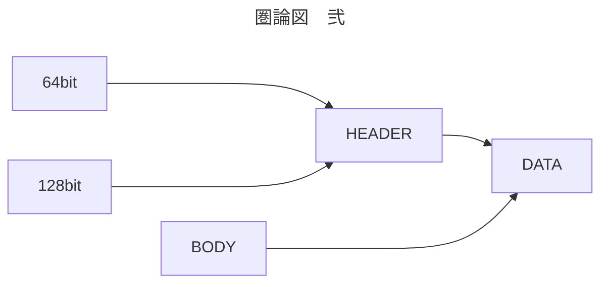
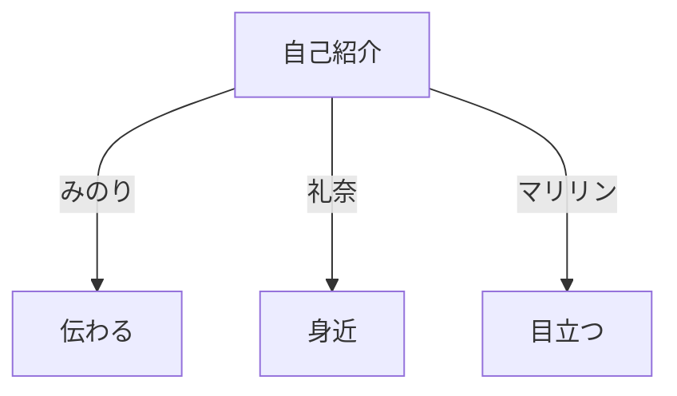
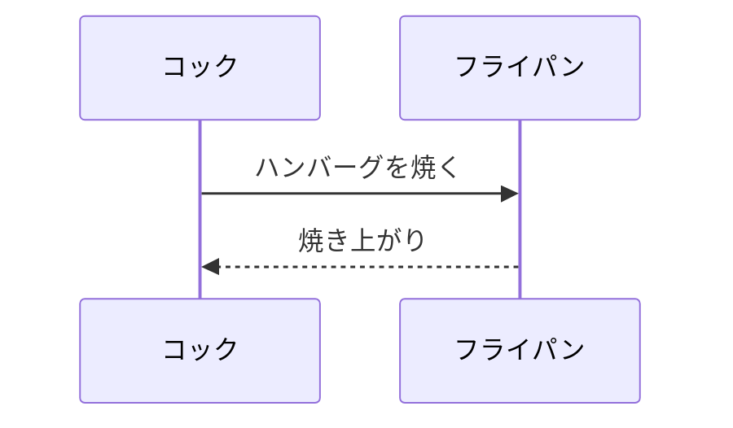

```mermaid
---
title: 圏論図　弐
---
flowchart LR
    h1["64bit"]--->HEADER-->DATA
    h2["128bit"]--->HEADER
    b[BODY]--->DATA
```

```mermaid
graph TD;
  自己紹介--->|みのり|伝わる;
  自己紹介--->|礼奈|身近;
  自己紹介--->|マリリン|目立つ;
  %% C-->D; ←これ
```

```mermaid
sequenceDiagram
    コック ->> フライパン: ハンバーグを焼く
    フライパン -->> コック : 焼き上がり

```
$\sqrt{3x-1}+(1+x)^2$
